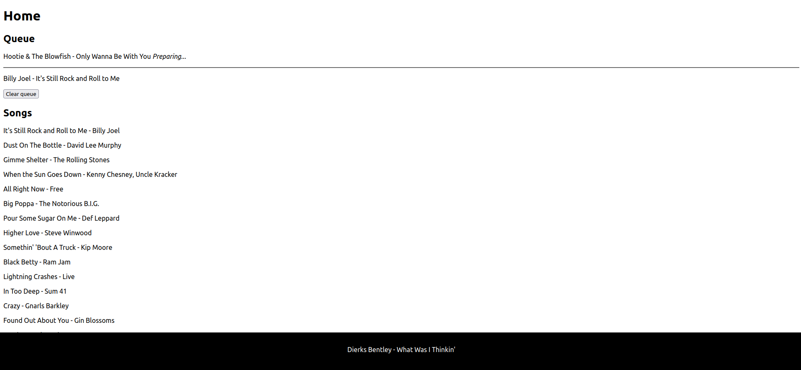

# PiFM

A complete radio station for the Raspberry Pi

## Features
- Web interface for management
- Get music from FTP
- Automated news reports
- Play MP3 files with no extra hassle

## Installation
1. Install the latest version of Raspbian on your Raspberry Pi
2. Close the repo:
```sudo apt install git && git clone https://github.com/Sid220/PiFM.git```
3. Run the installation script:
```cd PiFM && python3 install.py```
4. In the music directory you choose, put your music files (preferably MP3 or WAV, but other formats likely work)

You can then start the radio with ```python3 start.py```.
The Web UI is accessible from ```http://<your-pi-ip>:8000```. Click songs to add them to the queue, and click songs in the queue to remove them.

## Screenshots


## Customise News Reports
By default, PiFM runs an automated news report every other hour. It begins with a musical intro, then an automated reading of latest headlines from the BBC RSS feed, and finally the latest video on the BBC's YouTube channel.

Using `conf.json` you can customise which parts you wish to include, and change the RSS feeds and YouTube channel.
For example if you want to read from the CNN RSS feed instead of the BBC's and to not include the YouTube or intro portions, change the config like this:
```json
...
  "news": {
    "enabled": true,
    "bbc": false,
    "intro": {
      "enabled": false,
      "file": "assets/News Theme Headline.mp3"
    },
    "rss": {
      "enabled": true,
      "url": "http://rss.cnn.com/rss/edition.rss",
      "max_headlines": 5
    },
    "youtube": {
      "enabled": false,
      "channel": "UC16niRr50-MSBwiO3YDb3RA"
    },
    "interval": 2
  }
...
```
It is a good idea to disable `bbc` in `conf.json` like above if you do this, which impacts some dialogue to make it more generic.

For more advanced customisation, you should edit the `news.py` file. 

## Disclaimer
In most countries, transmitting radio waves without a state-issued licence specific to the transmission modalities (frequency, power, bandwidth, etc.) is illegal.

Therefore, always connect a shielded transmission line from the Raspberry Pi directly to a radio receiver, so as not to emit radio waves. Never use an antenna.

Even if you are a licensed amateur radio operator, using PiFM to transmit radio waves on ham frequencies without any filtering between the Raspberry Pi and an antenna is probably illegal as bandwidth requirements are likely not met.

I could not be held liable for any misuse of your own Raspberry Pi. Any experiment is made under your own responsibility.

From [fm_transmitter](https://github.com/markondej/fm_transmitter) (the backend of this project):
### Legal note
Please keep in mind that transmitting on certain frequencies without special permissions may be illegal in your country.
